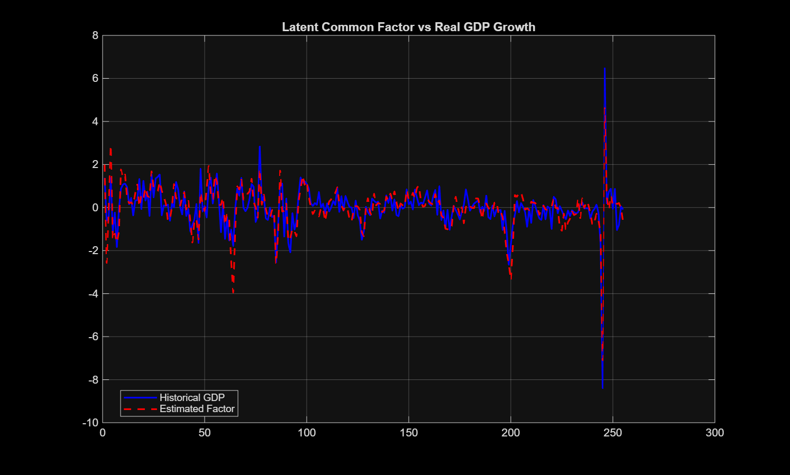
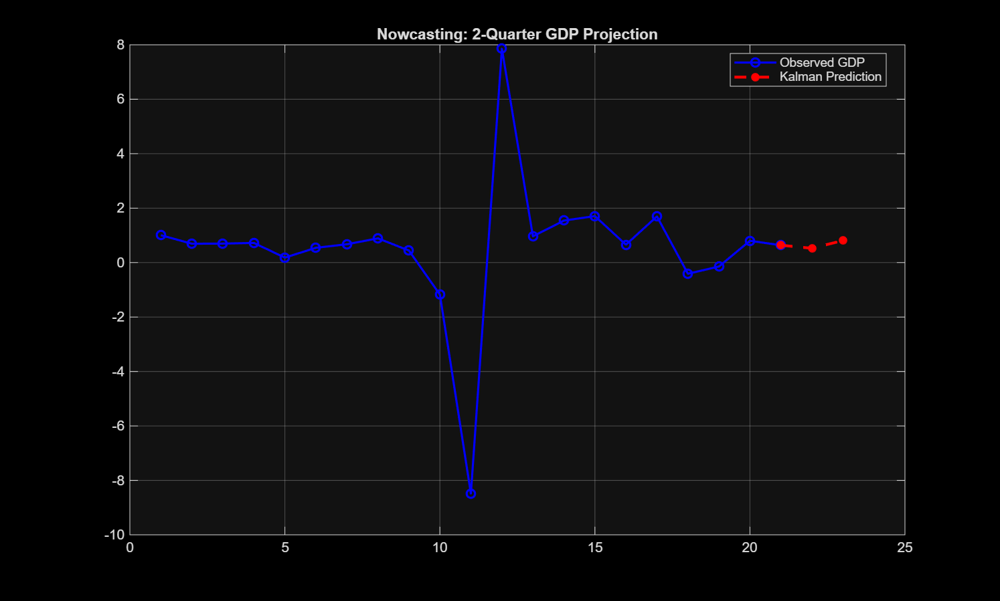

# 📈 Macroeconomic Nowcasting: Dynamic Factor Model & Kalman Filter

> **⚠️ IMPORTANT NOTE:** > **Python Migration in Progress:** I am currently translating this State-Space architecture from MATLAB to Python.

## 🏛️ 1. Executive Summary & Business Impact

**The Problem:** Official macroeconomic data (like Quarterly GDP) suffers from severe publication lags. Fintechs, investment funds, and corporate strategy teams cannot wait months to understand the current state of the economy; they need to make strategic pricing and risk decisions *today*.

**The Solution:** This project implements a **Dynamic Factor Model (based on Stock & Watson)** to perform real-time Nowcasting. By extracting a latent "common signal" from high-frequency (monthly) noisy indicators, the model applies a **Kalman Filter** to predict low-frequency (quarterly) GDP growth before official institutions publish the data.

## 📊 2. Methodology: The State-Space Representation

The model is formulated as a linear State-Space system. To handle the autocorrelation of the idiosyncratic errors, they are absorbed into the unobservable state vector $h_t$, resulting in a pure white-noise measurement equation.

**Measurement Equation (Observation):**

$$y_t = H h_t$$

Where $y_t$ contains the standardized monthly observables (e.g., Industrial Production, Sales), and $H$ is the loading matrix.

**Transition Equation (System Dynamics):**

$$h_t = F h_{t-1} + v_t$$

The state vector $h_t = [f_t, e_{1t}, e_{2t}]'$ follows an AR(1) process where $f_t$ is the latent macroeconomic cycle, and $e_{it}$ are the specific shocks of each series.

**The Mixed-Frequency Challenge:**
To map the monthly latent factor to the quarterly GDP, the algorithm implements the **Mariano-Murasawa (2003) approximation**. It mathematically smooths the monthly signal into an annualized quarterly growth rate using a moving average weight structure: $[\frac{1}{3}, \frac{2}{3}, 1, \frac{2}{3}, \frac{1}{3}]$.

## ⚙️ 3. Algorithmic Implementation (The Kalman Filter)

The parameters $\theta$ (factor loadings $\lambda$, AR coefficients $\phi, \psi$, and shock variances $\sigma^2$) are estimated via **Maximum Likelihood Estimation (MLE)** using a numerical optimizer (`fminunc`).

For each iteration, the Kalman Filter performs the recursive loop:

**1. Prediction:**

$$\hat{h}_{t|t-1} = F\hat{h}_{t-1|t-1}$$

**2. Innovation (Forecast Error):**

$$e_{t|t-1} = y_t - H\hat{h}_{t|t-1}$$

**3. Update (Kalman Gain):**

$$\hat{h}_{t|t} = \hat{h}_{t|t-1} + K_t e_{t|t-1}$$

Finally, a **Bridge Equation (OLS Regression)** translates the abstract latent factor into real GDP percentage growth units:

$$GDP_t = \beta_0 + \beta_1 \hat{f}^{Q}_t + u_t$$

## 💡 4. Results & Business Implications

### Latent Factor vs. Historical GDP
As shown below, the Kalman Filter successfully isolates the macroeconomic cycle. The model is highly sensitive to abrupt economic downturns, meaning **it detects recessions in real-time** as monthly sales and production drop simultaneously.

### Real-Time Nowcasting Projection
Using the optimal transition matrix $F$, the Markov Chain is projected forward. The Bridge Equation translates this momentum into a highly accurate 2-quarter GDP forecast.

## 📚 5. References & Acknowledgments

This algorithmic implementation is deeply grounded in macroeconomic theory and time-series econometrics. The core state-space representation and factor extraction methodology are based on the foundational work by:

* **Stock, J. H., & Watson, M. W. (1988).** *A Probability Model of the Coincident Economic Indicators* (NBER Working Paper No. 2772). National Bureau of Economic Research.
* **Mariano, R. S., & Murasawa, Y. (2003).** *A New Coincident Index of Business Cycles Based on Monthly and Quarterly Series.* Journal of Applied Econometrics.

**Acknowledgments:**
The MATLAB architecture and modeling approach in this repository are heavily inspired by a more advanced, multi-variable Nowcasting framework developed by my professor, **Gabriel Perez Quiros**. This project serves as a streamlined adaptation of his teachings, focusing on the core mechanics of the dynamic factor model and the Kalman Filter.

---
*Developed by **Luis Martínez Vicente** - Economist & Data Scientist*
*[Connect on LinkedIn -> Still to be updated](https://www.linkedin.com/in/luis-mart%C3%ADnez-77a857331/)*
